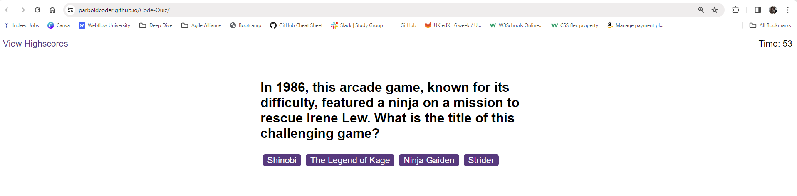
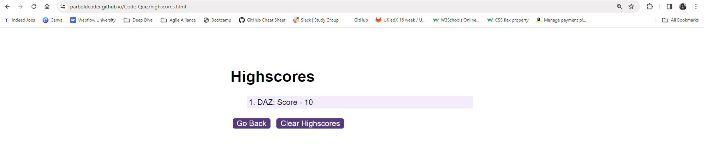

# Code-Quiz Challenge

## Description
 
On this challenge I built a quiz using JavaScript across three seperate JavaScript files.
 
 
The logic is the largest section of code, as this code establishes a quiz application. 
 
It sets up key elements and event listeners for starting, displaying questions, giving feedback, managing a timer, and ending the quiz. Notably, it shuffles questions, checks answers, and handles highscore saving with initials.
 
 
The scores code does three main things. 
 
Firstly, it loads highscores from local storage when the page is fully loaded. 
 
Secondly, it displays these highscores on the webpage. 
 
Thirdly, it allows users to clear the displayed highscores by clicking a "Clear" button. The code handles these actions when the page loads and when the "Clear" button is clicked.
 
 
The questions.js is where I have a list of gaming questions with options and correct answers. 
 
To mix things up, I shuffled the order of the questions using a randomization technique. 
 
This way, when someone uses these questions, they get them in a random order each time, making the experience more interesting.
 
 
I did find this challenging and rewarding at the ennd when I eventually completed the task.
 
 
## Application images

 

 

 

## Application URLs
https://github.com/ParboldCoder/Code-Quiz
 
https://parboldcoder.github.io/Code-Quiz/
 
## Author
Darren Buck
https://github.com/ParboldCoder